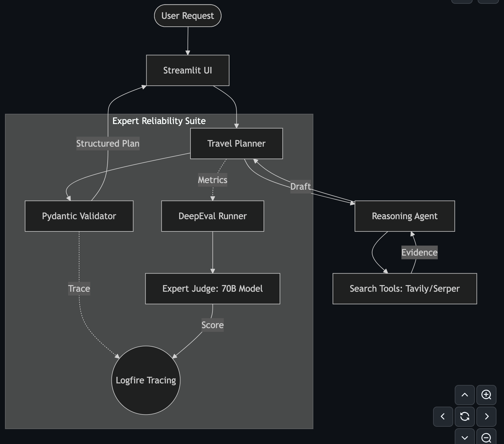
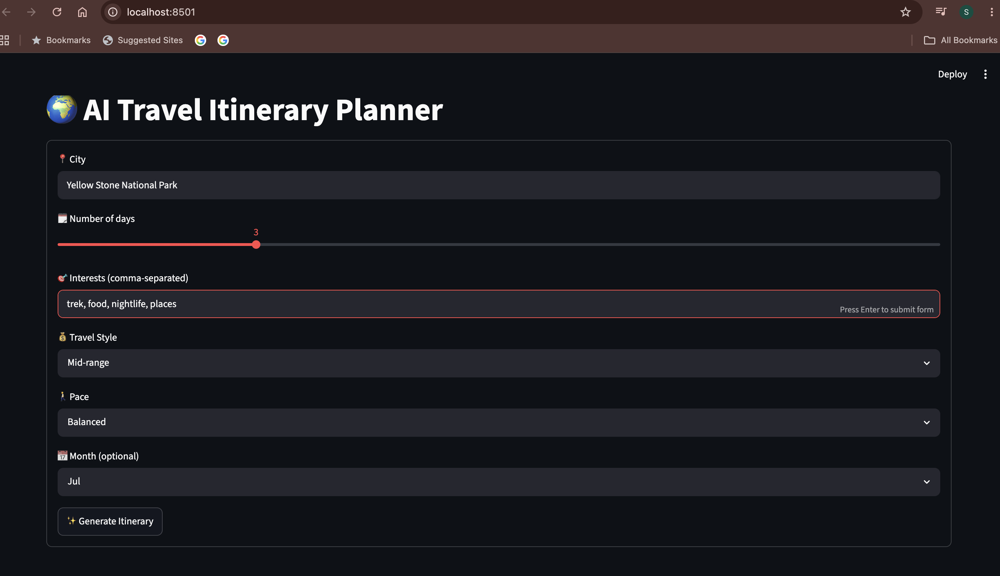
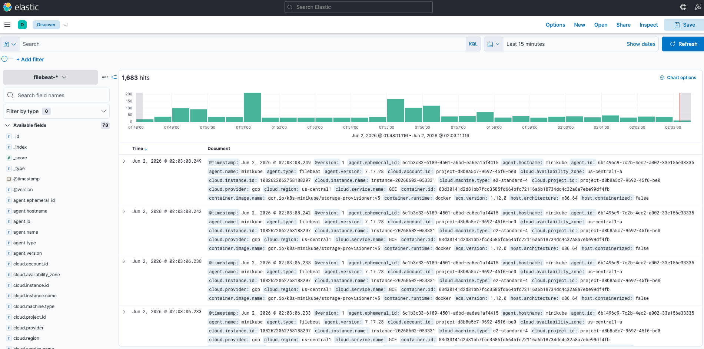
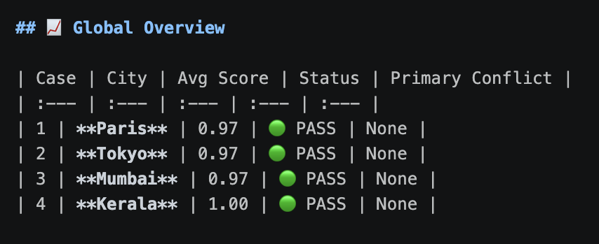
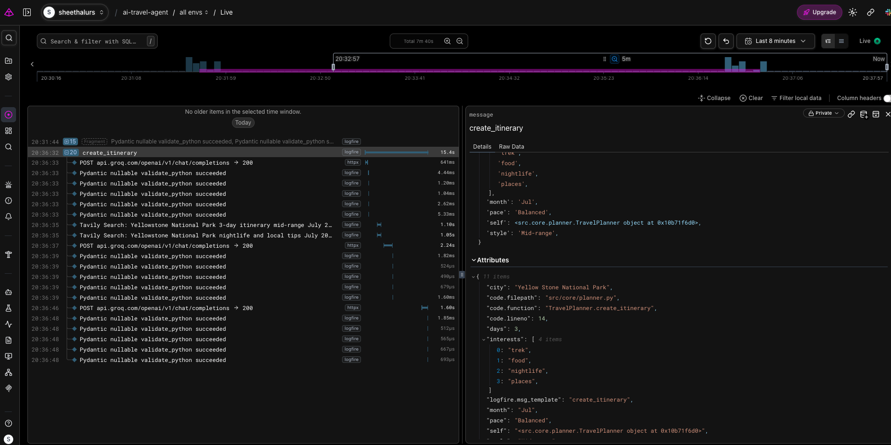

# 🌍 AI Travel Planner Agent — LangChain + Groq + DeepEval

An AI-powered travel planning system that uses **LangChain Agents**, **Groq Llama 3.3 70B**, real-time web search, structured outputs, observability, and automated evaluation to generate personalized travel itineraries.

Built as a **production-style Agentic AI application** with tool calling, validation, tracing, and monitoring.

---

## Project Overview

This project demonstrates a modern LLM application using:

* LangChain v1 Agent
* Groq Llama 3.3 70B
* Tavily + Google Serper Search
* Pydantic Structured Outputs
* DeepEval Evaluation
* Logfire Observability
* ELK Stack Monitoring

---

## Key Features

* ✅ Real-time AI travel planning
* ✅ Multi-tool search using Tavily and Serper
* ✅ Structured itinerary generation with Pydantic
* ✅ DeepEval-based quality evaluation
* ✅ Logfire tracing for agent execution
* ✅ ELK monitoring with Elasticsearch and Kibana
* ✅ Dockerized and Kubernetes-ready setup

---

## Architecture



---

## Pipeline Flow

```text
User Request
   ↓
Streamlit UI
   ↓
Travel Planner
   ↓
LangChain Agent
   ↓
Tavily + Google Serper Search
   ↓
Groq Llama 3.3 70B
   ↓
Pydantic Validation
   ↓
Generated Travel Itinerary
   ↓
DeepEval + Logfire + ELK Monitoring
```

---

## Application Preview

### User Input



---

### Generated Itinerary


---

## Observability

### Logfire Agent Tracing



The system tracks:

* Agent execution
* Tool calls
* LLM requests
* Pydantic validation
* Runtime latency
* Errors and retries

---

## Evaluation Results



---

## Monitoring

### ELK / Kibana Logs



Centralized logs are monitored using Elasticsearch, Logstash, Kibana, and Filebeat.

---

## Tech Stack

| Category        | Tools                           |
| --------------- | ------------------------------- |
| LLM             | Groq Llama 3.3 70B              |
| Agent Framework | LangChain                       |
| Search          | Tavily, Google Serper           |
| Validation      | Pydantic                        |
| Evaluation      | DeepEval                        |
| Observability   | Logfire                         |
| Frontend        | Streamlit                       |
| Deployment      | Docker, Kubernetes              |
| Monitoring      | Elasticsearch, Kibana, Filebeat |

---

## Project Structure

```text
ai-travel-planner/
├── src/
│   ├── agents/          # AI agents logic (Travel Agent)
│   ├── config/          # Configuration management
│   ├── core/            # Core application logic
│   ├── models/          # Pydantic models for structured output
│   ├── tools/           # Search and external tool integrations
│   └── utils/           # Helper functions and utilities
├── evals/               # Evaluation scripts and gold standard datasets
├── experiments/         # Experimental notebooks and research scripts
├── project_documentation/ # Detailed technical guides
├── app.py               # Streamlit UI entry point
├── requirements.txt     # Python dependencies
├── Dockerfile           # Production container setup
└── k8s-deployment.yaml # Kubernetes orchestration configs
```

---

## Run Locally

```bash
git clone <repo-url>
cd ai-travel-planner

pip install -r requirements.txt

streamlit run app.py
```

---

## Why This Project Stands Out

* End-to-end Agentic AI workflow
* Real-time search-based itinerary generation
* Structured and validated LLM outputs
* Evaluation pipeline with measurable quality scores
* Production-style observability using Logfire
* Monitoring-ready infrastructure with ELK Stack

Mirrors modern **LLM-powered production systems** used in AI startups and enterprise applications.
